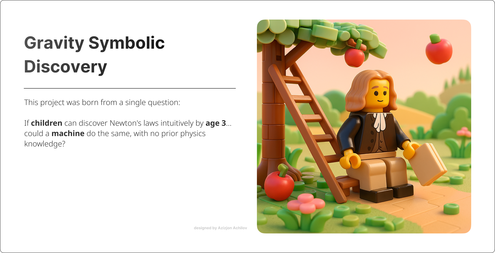

# Gravity Symbolic Discovery


> Can a neural-symbolic model rediscover the laws that a 3-year-old can intuitively grasp?

---

## 🧠 Why This Project?

This project was born from a single question:

> “If children can discover Newton's laws intuitively by age 3…  
> ...could a machine do the same, with no prior physics knowledge?”

Inspired by this thought, I built a system that uses **symbolic regression** to rediscover physical laws such as:

- $$( a = g )$$
- $$( a = \frac{2h}{t^2} )$$
- $$( F = ma )$$

The result?  
✅ It works — **three separate models**, each learning a core physical equation from data, with near-perfect accuracy.

---

## 📁 Project Structure


Each folder represents a self-contained model setup, trained on synthetic but physically realistic data.

---

## 🔬 Overview of Each Model

### 1️⃣ Clean Vacuum (`00_clean_vacuum`)

- No air resistance  
- Acceleration derived from time & height  
- Model discovers:
  $$a = g$$

---

### 2️⃣ Air & Water Resistance (`02_air_resistance`)

- Resistance factor alters fall time  
- Simulates air and water environments  
- Model discovers:
  $$a = g + R \cdot (R \cdot 0.2169 - 1.9325)$$
- A nonlinear correction for resistance — learned from scratch.

---

### 3️⃣ Newton’s Second Law (`03_force_equals_ma`)

- Inputs: mass and acceleration  
- Target: force  
- Model rediscovers:
  $$F = m \cdot a$$

✅ With perfect $$( R^2 = 1.0 )$$

---

## 🧠 Key Insight

> These models rediscover the same physical laws that humans learn through experience — but do so **only from data**, with no equations given.

Symbolic regression offers a powerful bridge between **machine learning** and **scientific reasoning**, generating interpretable formulas rather than black-box predictions.

---

## 📊 Synthetic Data Generation

To explore whether a machine can rediscover the fundamental laws of physics without being explicitly told them, we generated two synthetic datasets. Each simulates a real-world physical scenario in a controlled yet realistic way.

---

### ⚙️ 1. Free Fall with Environmental Resistance

We modeled objects falling from different heights in three environments: vacuum, air, and water. The fall time was adjusted using a manually defined resistance factor, simulating drag or fluid friction.

#### 🧮 Underlying idea:

> Fall time increases as air or water resistance increases. We simulate this using a simple scaling factor.

#### 🧾 Code snippet:

```python
import numpy as np

n = 5000
np.random.seed(42)

height = np.random.uniform(1, 100, size=n)       # Random height in meters
gravity = np.full(n, 9.81)                       # Constant gravitational acceleration

# Randomly assign environments
environments = np.random.choice(['vacuum', 'air', 'water'], size=n, p=[0.2, 0.6, 0.2])

# Manual mapping of resistance
def get_air_resistance(env):
    if env == 'vacuum': return 0.0
    if env == 'air': return 0.5
    if env == 'water': return 2.0

air_resistance = np.array([get_air_resistance(e) for e in environments])

# Calculate fall time and back-calculate acceleration
fall_time = np.sqrt(2 * height / gravity) * (1 + 0.1 * air_resistance)
acceleration = 2 * height / fall_time**2
```
---

## 🧪 Symbolic Discovery of Newton’s Second Law — $$( F = m \cdot a\)$$

In this experiment, we explored whether a machine can rediscover Newton’s second law of motion from pure numeric data.

We generated a synthetic dataset of 5000 examples using randomized values for mass and acceleration. The force was computed directly using the classical physics formula:

$$
F = m \cdot a
$$

---

### 🧰 Data Generation Code

```python
np.random.seed(42)
n = 5000

mass = np.random.uniform(0.1, 100, size=n)         # Random mass (kg)
acceleration = np.random.uniform(0.1, 20, size=n)  # Random acceleration (m/s²)
force = mass * acceleration                        # Newton's 2nd Law

```
## 📈 Tools Used

- `pysr` — Symbolic regression engine  
- `numpy`, `pandas` — Data simulation  
- `scikit-learn` — Evaluation metrics  
- `matplotlib` — Visualizations

Install all with:

```bash
pip install pysr numpy pandas scikit-learn matplotlib
